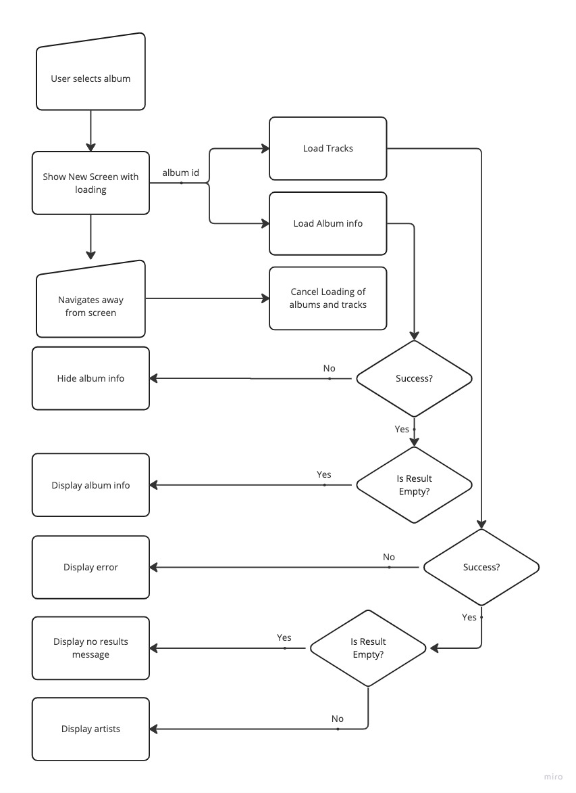
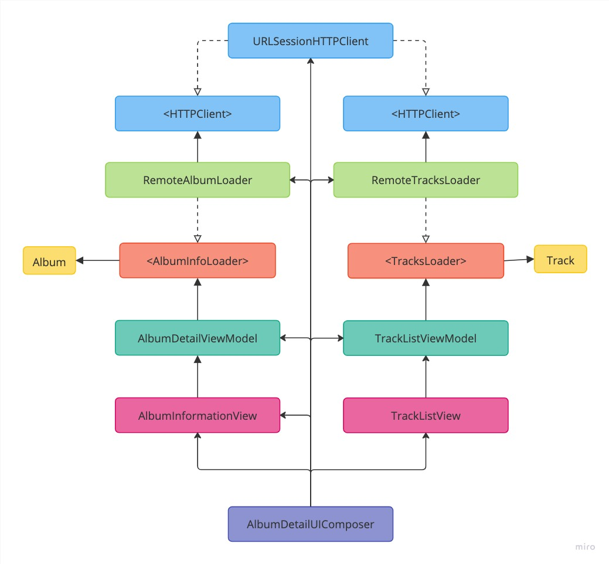

# Artist Feature
This page contains the specs and architecture for the Album detail feature.

Also see the [API page](API.md#artist-search) for more details on the data being used for this feature.

## User Story 1
```
As an online customer
I want to see all music tracks for an album
So I can find a specific track on an album
```

### Acceptance Criteria
```
Given the customer has connectivity
	And a non-empty list of albums is shown
	When the customer selects one album
	And the remote datasource has tracks related to that album
	Then the app should display a list of tracks for album

Given the customer has connectivity
	And a non-empty list of albums is shown
	When the customer selects one album
	And the remote datasource has no tracks related to that album
	Then the app should display a message indicating no tracks were found for the selected album
```

### Use Cases
**Load Tracks For Album From Remote Use Case**

Data:

- URL
- Album ID

**Primary course:**

1. Execute “Load Tracks” command with above data
2. System downloads data from the URL
3. System validates downloaded data
4. System create tracks from valid data
5. System delivers tracks

**Cancel course:**

1. System does not deliver tracks nor error.

**Invalid data - error course:**

1. System delivers invalid data error

**No data course**:

1. System delivers no tracks

**No connectivity - error course**:

1. System delivers connectivity error


## User Story 1
```
As an online customer
I want to see information an album
So I can learn more about an album
```

### Acceptance Criteria
```
Given the customer has connectivity
	And a non-empty list of albums is shown
	When the customer selects one album
	And the remote datasource has information related to that album
	Then the app should display that information

Given the customer has connectivity
	And a non-empty list of albums is shown
	When the customer selects one album
	And the remote datasource has no information related to that album
	Then the app should not display the information for that album
```

### Use Cases
**Load Album Info From Remote Use Case**

Data:

- URL
- Album ID

**Primary course:**

1. Execute “Load Album Info” command with above data
2. System downloads data from the URL
3. System validates downloaded data
4. System create album information from valid data
5. System delivers album information

**Cancel course:**

1. System does not deliver album information nor error.

**Invalid data - error course:**

1. System delivers invalid data error

**No data course**:

1. System delivers no album information

**No connectivity - error course**:

1. System delivers connectivity error

## Flow chart


## Architecture

