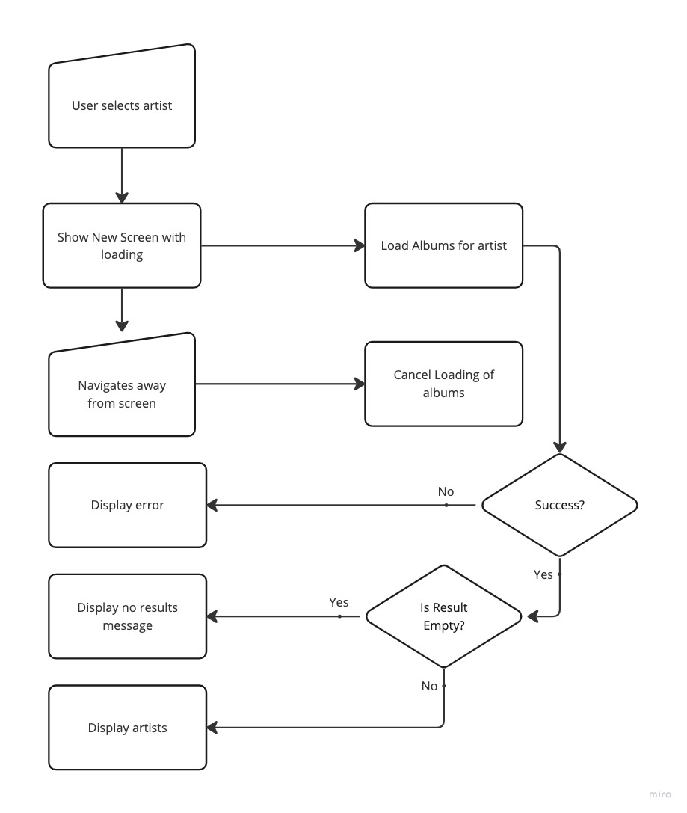
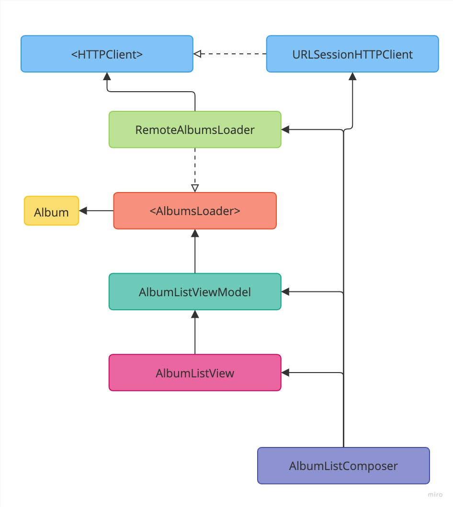

# Album List Feature
This page contains the specs and architecture for the Album list feature.

Also see the [API page](API.md#artist-search) for more details on the data being used for this feature.

## User Story
```
As an online customer
I want to see all albums for a music artists
So I can find a specific album for a given music artis
```

### Acceptance Criteria
```
Given the customer has connectivity
	And a non-empty list of music artists is shown
	When the customer selects one music artist
	And the remote datasource has albums related to that music artist
	Then the app should display a list of almbums for that music artist

Given the customer has connectivity
	And a non-empty list of music artists is shown
	When the customer selects one music artist
	And the remote datasource has no albums related to that music artist
	Then the app should display a message indicating no albums were found for the selected music artist
```

### Use Cases
**Load Albums For A Artist From Remote Use Case**

Data:

- URL
- Artist ID

**Primary course:**

1. Execute `Load Albums` command with above data
2. System downloads data from the URL
3. System validates downloaded data
4. System create albums from valid data
5. System delivers albums

**Cancel course:**

1. System does not deliver albums nor error.

**Invalid data - error course:**

1. System delivers invalid data error

**No data course**:

1. System delivers no albums

**No connectivity - error course**:

1. System delivers connectivity error

## Flow chart


## Architecture

