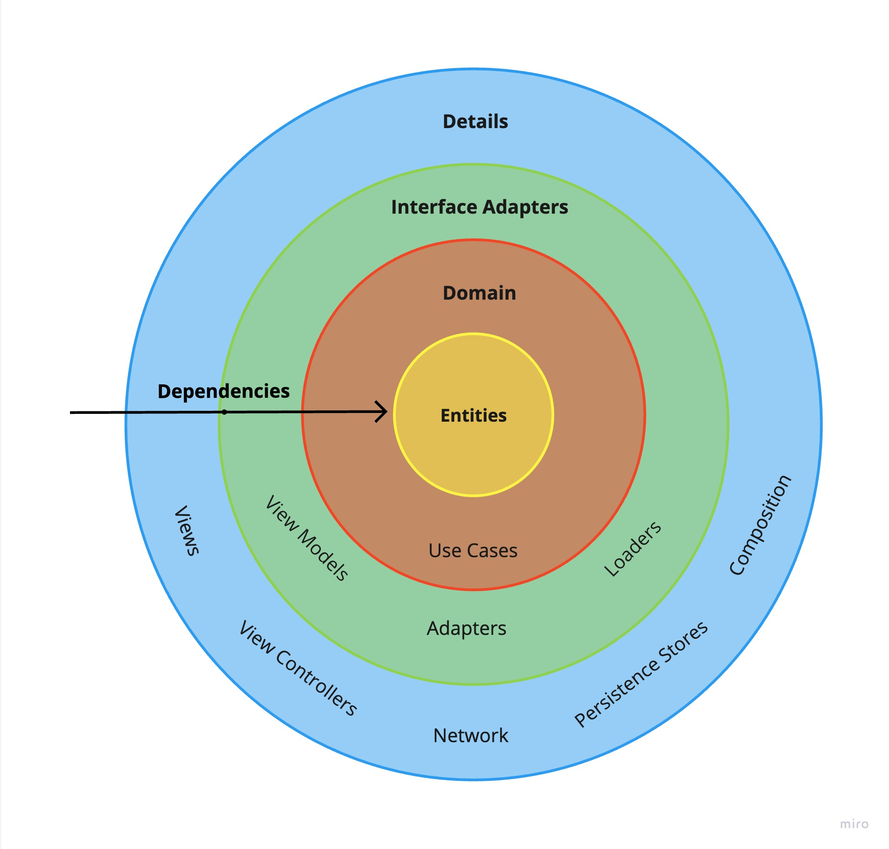

# General Architecture overview
The diagram belows shows the general architecture of the app, where each layer is represented by a color.

This architecture adheres to the principles of __Clean Architecture__, relying on use cases in the form of `Loaders` and adhering to the `Dependency Rule`.

The diagram below shows a high level translation to the __Clean Architecture__ and the architecture used in this app.
The colours used are also representative in the Architecture diagrams

All layers are highly de-coupled from each other and relies on composition components to compose the features as needed.
Each Feature Module exposes a `-Factory` interface that is implemented by the `FeatureFactory` in the `iOS App`. The `FeatureFactory` is where all the composition happens.
As seen in the diagram below, the `FeatureFactory` has references to all modules to inject and compose as needed.

Coordinators serve as the navigation components, that will present each screen and reference the `FeatureFactory` for the components.

> DISCLAIMER: \
> Not all the components are shown in the diagram below, some components were not included to make the diagram simpler and easier to follow.

