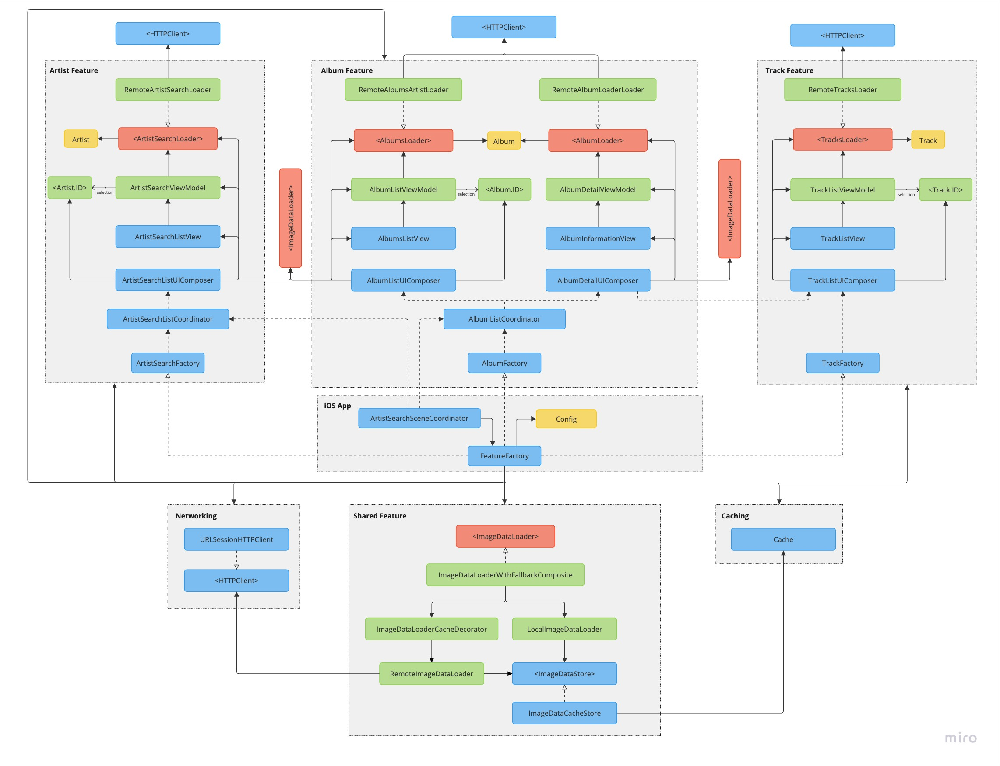

# General Architecture overview
The diagram belows shows the general architecture of the app, where each layer is represented by a color.

This architecture adheres to the principles of __Clean Architecture__, relying on use cases in the form of `Loaders` and adhering to the `Dependency Rule`.

All layers are highly de-coupled from each other and the composition rule then composes all layers together as needed.
The main actors in the composition layer are the coordinators, which interacts with a factory to build each view and then present it on screen.

