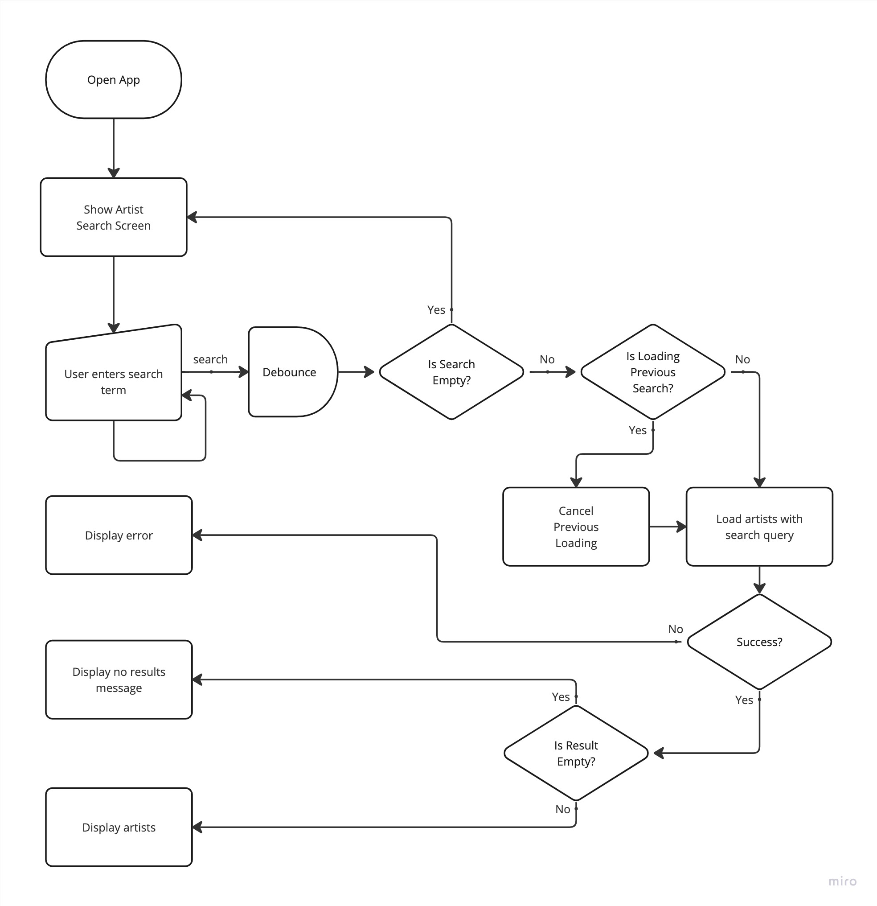
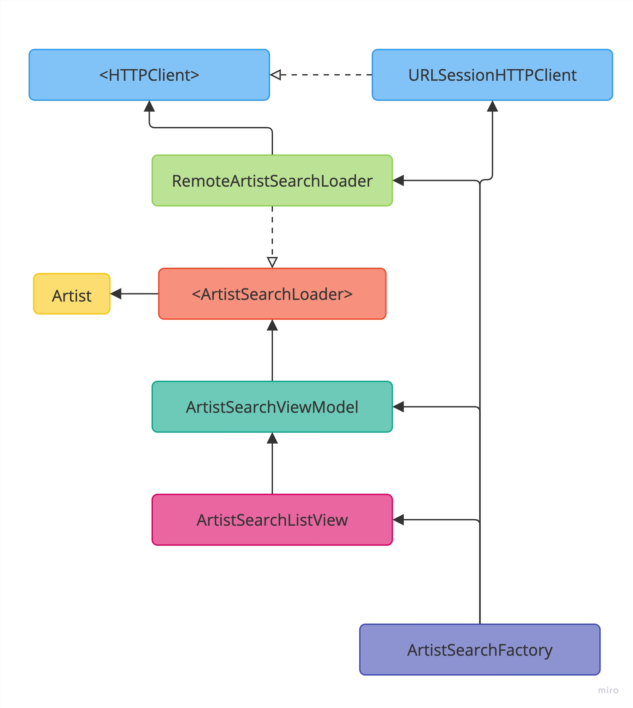

# Artist Search Feature
This page contains the specs and architecture for the Artist Search feature.

Also see the [API page](API.md#artist-search) for more details on the data being used for this feature.

## User Story
```
As an online customer
I want to search for music artists and be shown a list matching my search
So I can find a specific music artist
```

### Acceptance Criteria
```
Given the customer has connectivity
    When the customer hasn't entered a search term for a music artist
    Then the app should display a message indicating no search was given

Given the customer has connectivity
    When the customer searches for a music artist
    And the search term matches any music artist from the remote datasource
    Then the app should display a list of music artists matching the search

Given the customer has connectivity
    When the customer searches for a music artist
    And a partial search term matches any music artists on the remote datasource
    Then the app should display a list of music artists matching the partial search term

Given the customer has connectivity
    When the customer searches for a music artist
    And the search term doesn't match any music artists on the remote datasource
    Then the app should display a message inidicating no artists were found matching the search term
```

### Use Case
**Load Artists With Search From Remote Use Case**

Data:
- URL
- Search query

**Primary course:**
1. Execute `LoadArtists` command with above data
2. System validates search query is not empty
3. System downloads data from the URL
4. System validates downloaded data
5. System create artists from valid data
6. System delivers artists

**Cancel course:**
1. System does not deliver artists nor error.

**Empty search query - error course:**
1. System aborts download of data
2. System delivers no artists

**Invalid data - error course:**
1. System delivers invalid data error

**Invalid data - no data**:
1. System delivers no artists

**No connectivity - error course**:
1. System delivers connectivity error

## Flow chart


## Architecture

