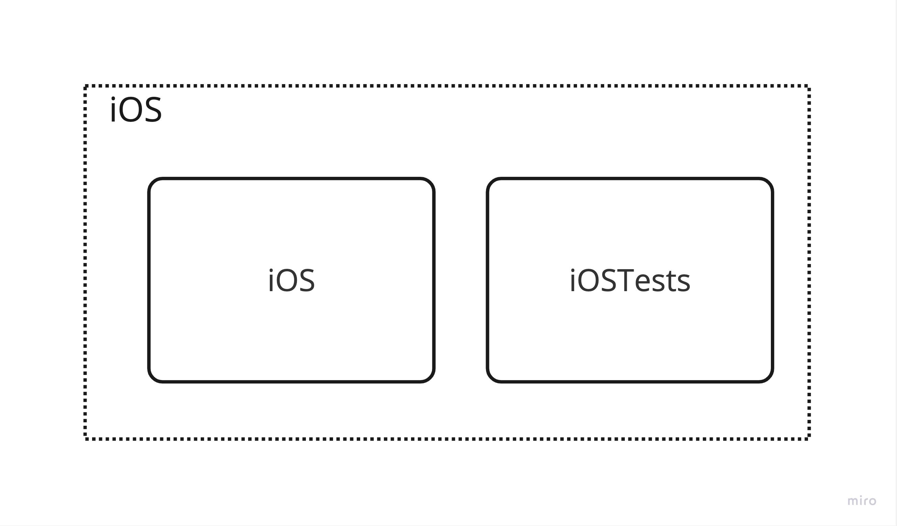
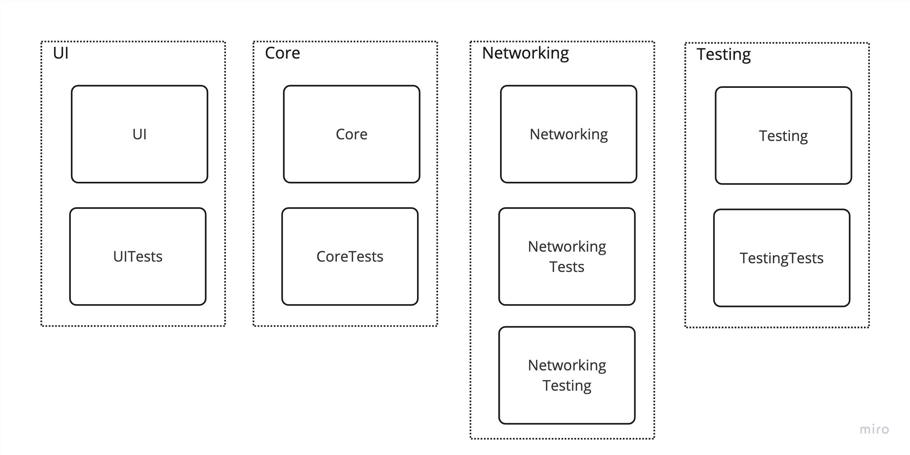
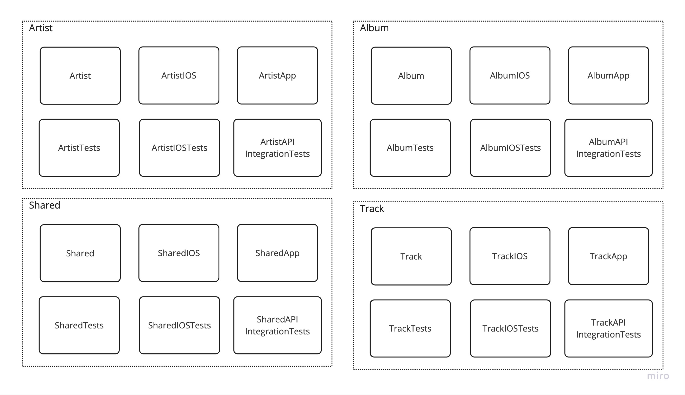

# Modules Overview
This page gives an overview of the modular approach taken for this app.

> DISCLAIMER: The modular break-down might seem **_WAY_** over the top for this small app, but the modules are more aimed to show the modular approach for bigger, real world apps. The size of and boundary of each module will depend and be different for each app, i.e. each domain does not need to be in its own feature module, it was done like this just for demonstration purposes.

The modules can be broken down into 3 types:
- App
- Foundation
- Feature

Refer to [µFeatures Architecture](https://docs.tuist.io/building-at-scale/microfeatures/) for more information on this topic.

## App Modules
App modules will be the end-product being shipped to the App store and will generally be focussed on a specific platform, eg, iOS, macOS, tvOS etc..

The diagram below shows the targets contained within the `iOS` app module.

> See [Project Structure - Apps](ProjectStructure.md#apps) for more details on the directory structure for this module

## Foundation Modules
`Foundation` modules contain foundational tools that are combined to build other modules.
These modules can only be dependent on **other** `Foundation` modules. They tend to have generic and feature independent components, helpers and extensions.
They are typically imported by `Feature Modules` and will serve as building tools to compose features.

The diagram below shows the different `Foundatation` modules for the app and the targets withing each.

The modules have the following domains:
- Core - Extensions and helpers on system libraries and custom defined types.
- UI - UI related extension and helpers, and re-usable views.
- Networking - The core networking details, extensions and helpers.
- Testing - All things that aid in helping write better and faster tests.

> NOTE: Networking has one extra target called `NetworkTesting` that has components to facilitate in writing tests against this module, like spies and fixtures.

> See [Project Structure - Foundation](ProjectStructure.md#foundation) for more details on the directory structure for these module.

## Feature Modules
`Feature` modules contain features that the user can feel and interact with.
They are built by combining foundation modules, and sometimes other feature modules.

The diagram below shows the different `Feature` modules for the app and the targets withing each.

Each module contains each domain and will typically have platform specific targets, like `iOS` where the feature is specialised for that platform specifically.
The targets without a platform suffix is considered platform-agnostic and can be used on any platform. Each target will also have its testing counter part.

Each module will also have a companion example app to launch that specific feature in isolation.

Integration tests are in its own module to easily separate them in testing configurations.

> NOTE: The `Shared` feature is a feature module that contains components that can be used by other feature modules, like generic lists which is too specialised for the app and should not be in the UI module for example.

> See [Project Structure - Feature](ProjectStructure.md#feature) for more details on the directory structure for these module.
