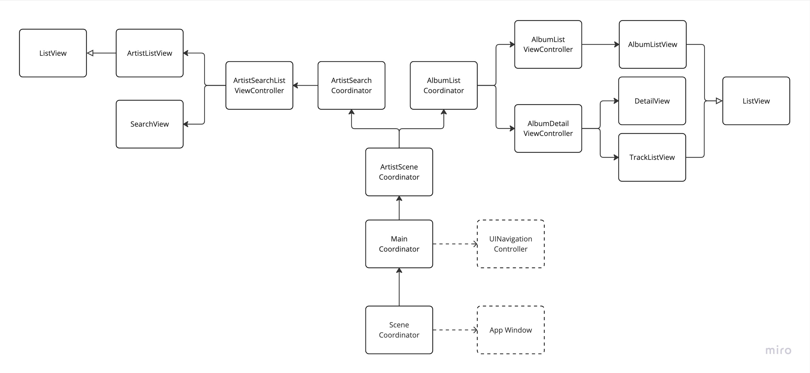

# Navigation Overview
The diagram belows shows an overview of the navigation tree in the app.

> DISCLAIMER: The coordinator break-down might not be very representable of a real world app, i.e. _too much_ for this size app, but show-cases some common scenarios for a real world app. e.g. child coordinators etc.

`Coordinators` takes responsibility of building calling the `FeatureFactory` to obtain a specific `ViewController` and present it on screen.
Each `Coordinator` is self contained and can present a whole feature scene end-to-end with minimum input, like an `ID`, which should also simplify deep-linking.

`ViewControllers` take the responsibility to compose different `SwiftUI` views together to form a specific feature screen.

`SwiftUI Views` are mostly generic screens to encourage re-usability and make building of feature screen easy and felxible.

